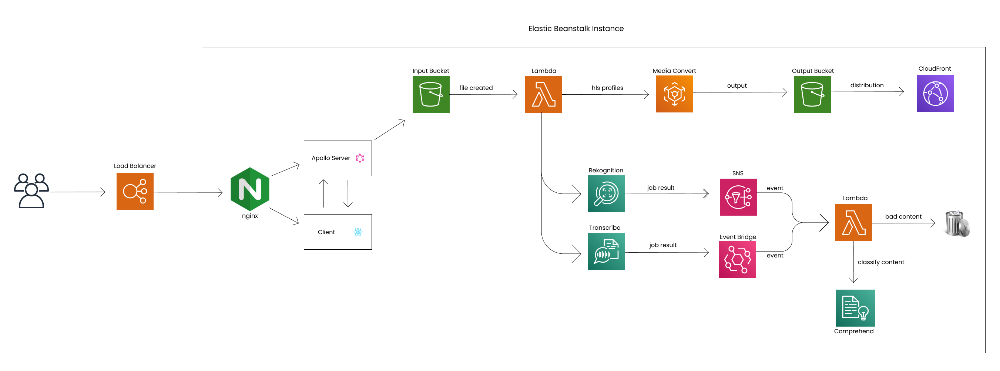
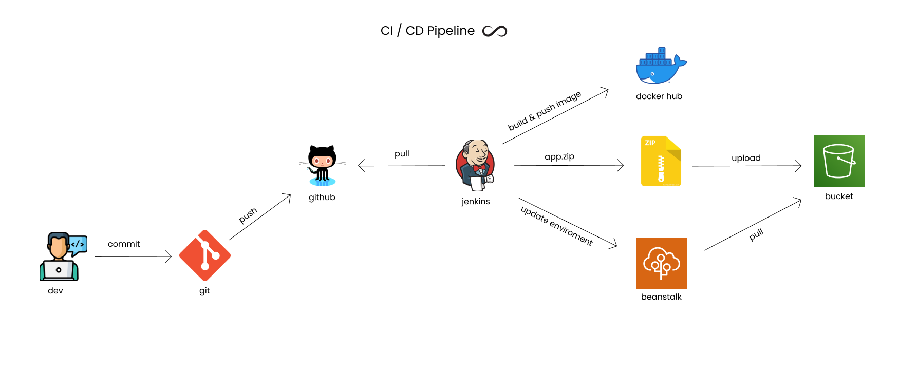

<h1 align="center">Node Streaming 🎥</h1>

Essa aplicação foi criada para servir como uma plataforma de upload de vídeos, onde os usuários fazem upload de seus vídeos e, a partir disso, é realizada a moderação de conteúdo em tempo real. Os usuários podem assistir aos vídeos em diferentes resoluções, incluindo 1080p, 720p e 360p.

## 👀 Overview

Este é um gif demonstrando o projeto

## 🌬️ Workflow

Este é o principal da aplicação

## 🌬️ Workflow

A esteira de automação (pipeline CI/CD)

## 🔧 Tecnologias

Este projeto utiliza **principalmente** as seguintes tecnologias:

- Node.js: Ambiente de execução JavaScript
- GraphQL: Linguagem de consulta para APIs
- React: Biblioteca JavaScript para construção de interfaces de usuário
- TypeScript: Superset tipado do JavaScript
- Express: Framework de aplicativo da web para Node.js
- Apollo Server: Implementação de servidor GraphQL
- Apollo Client: Cliente GraphQL para React
- AWS: Plataforma para utilização de serviços em Nuvem
- Socket.io: Comunicação bidirecional entre cliente e servidor
- Serverless: Framework para facilitar a criação de aplicações em nuvem 
- Jenkins: Desenvolvimento da pipeline CI/CD

## 🧐 Contribuindo

Se você quiser contribuir para este projeto, siga estes passos:

    Fork este repositório
    Crie uma nova branch (git checkout -b nova-feature)
    Faça as alterações desejadas e faça commit das suas mudanças (git commit -am 'Adiciona nova feature')
    Envie para o branch (git push origin nova-feature)
    Crie um novo Pull Request e aguarde o feedback

## 🔑 Licença

Este projeto está licenciado sob a licença MIT. Consulte o arquivo LICENSE para obter mais informações.

&nbsp;

Developed with 💜 by Gabriel Moretti
